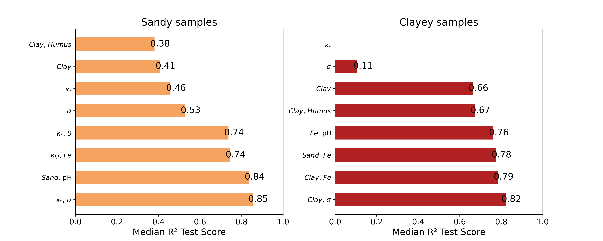

# kappa-CEC

[](https://mybinder.org/v2/gh/SENSE-UGent/kappa-CEC/HEAD?filepath=CEC-PTF.ipynb)



#### Repository accompanying the paperm“Exploring the link between cation exchange capacity and magnetic susceptibility”  
#### DOI: https://doi.org/10.5194/egusphere-2024-3306  

---

### Quick start

Clone, create a fresh virtual environment, install the dependencies and open the notebook:

```bash
git clone https://github.com/SENSE-UGent/kappa-CEC.git
cd kappa-CEC
python -m venv .venv && source .venv/bin/activate        # Windows: .venv\Scripts\activate
pip install -r requirements.txt
jupyter lab CEC-PTF.ipynb
```

---

Running every cell reproduces all figures in figures_output/ and tables in table_outputs/.

##### Repository layout
##### Path	Role
##### data/	small raw and processed datasets
##### figures_output/	figures generated by the notebook
##### table_outputs/	CSV tables for the manuscript
##### CEC-PTF.ipynb	main exploratory & modelling workflow
##### utils.py	helper functions (metrics, regressions)
##### plots.py	plot-specific helpers

--- 

Citing this work

Mendoza Veirana, G. M., Grison, H., Verhegge, J., Cornelis, W., and De Smedt, P. (2025): Exploring the link between cation exchange capacity and magnetic susceptibility, EGUsphere, https://doi.org/10.5194/egusphere-2024-3306.

#### If you build on this code or data, please cite the paper above.

License
MIT – see LICENSE.
